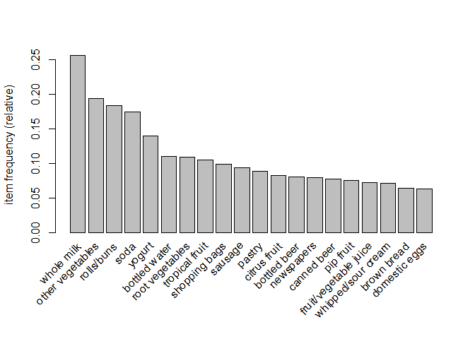

STA-380-Assignment-2
================
Jess Chung, Dani Diehl, Gihani Dissanayake, Chloe Kwon
August 16, 2017

Question 1
==========

### Flights at ABIA

Our goal here is to establish an understanding of the cause behind late departures from Austin. Is the late departure caused by the plane's late arrival? Or did the airport itself extend the delay?

``` r
library(dplyr)
```

    ## Warning: package 'dplyr' was built under R version 3.4.1

    ## 
    ## Attaching package: 'dplyr'

    ## The following objects are masked from 'package:stats':
    ## 
    ##     filter, lag

    ## The following objects are masked from 'package:base':
    ## 
    ##     intersect, setdiff, setequal, union

``` r
library(ggplot2)
```

    ## Warning: package 'ggplot2' was built under R version 3.4.1

``` r
library(ggmap)
```

    ## Warning: package 'ggmap' was built under R version 3.4.1

``` r
library(maps)
```

    ## Warning: package 'maps' was built under R version 3.4.1

``` r
library(mapdata)
```

    ## Warning: package 'mapdata' was built under R version 3.4.1

``` r
library(tidyr)
```

    ## Warning: package 'tidyr' was built under R version 3.4.1

``` r
abia <- read.csv("https://raw.githubusercontent.com/jgscott/STA380/master/data/ABIA.csv")
abia$Turnaround <- abia$ArrDelay - abia$DepDelay
abia[is.na(abia)] <- 0
abiaorigin <- filter(abia, Origin =="AUS")
```

    ## Warning: package 'bindrcpp' was built under R version 3.4.1

``` r
abiaorigin <- abiaorigin[(abiaorigin$Dest != "DSM")&(abiaorigin$Dest != "DTW"),]

#abiadest <- filter(abia, Dest =="AUS")
airports <- read.csv("https://raw.githubusercontent.com/jpatokal/openflights/master/data/airports.dat", header = FALSE)
colnames(airports) <- c("ID", "name", "city", "country", "IATA_FAA", "ICAO", "lat", "lon", "altitude", "timezone", "DST")


airportlatlon <- subset(airports, select = c(IATA_FAA, lat, lon))

abiaorigin = merge(abiaorigin, airportlatlon, by.x = "Dest", by.y = "IATA_FAA")
#abiadest = merge(abiadest, airportlatlon, by.x = "Origin", by.y = "IATA_FAA")
origindata = abiaorigin[,c("lat","lon","Turnaround","Month")]
average = aggregate(origindata[, 3], list(origindata$lat, origindata$lon), mean)
origindataturnaround = merge(origindata, average, by.x = c("lat","lon"), by.y = c("Group.1","Group.2"))

abialatlon <- filter(airportlatlon, IATA_FAA=="AUS") #separate df for abia

usa <- map_data("usa")
origin <- gather(data = origindataturnaround, -lon, -lat, -x, -Turnaround, key = "var", value = "value")
ggplot() + geom_polygon(data = usa, aes(x=long, y = lat, group = group)) + coord_fixed(1.3) + 
geom_curve(data=origin, aes(x = lon, y = lat, xend = abialatlon$lon, yend = abialatlon$lat, col = x), size = .01, curvature = .2) + 
 geom_point(data=origin, aes(x = lon, y = lat), col = "lightgreen", shape = "x") + scale_colour_gradient2()# + facet_wrap(~value, scales = "free")
```


By adding turn around time (the difference between the departure delay and the arrival delay) as a variable, we were able to view average delays with regards to different flights and then use that additional information to determine how much the Austin airport contributes to the delay of a flight. We wanted to excuse airports from flights that arrive late and then depart late, but the airport did not extend the delay further.

The graph shows the culmination of our analysis, which is the number of minutes the airport contributes to the delay. The redder routes have a slower turnaround time at the Austin airport, and blue routes have a faster turnaround time. For example, AUS was able to speed up the average turnaround tme for the flights to SEA, MSP, and CLT, while the flights to PHL on average was slowed down at AUS, and thus had a slower turnaround time.

We removed outliers such as th single flight from Des Moines, and the resulting range is fairly small: from the Austin airport extending the delay by 20 min to reducing the delay by 8 minutes. This small range is not surprising, as the internal processes for processing a plane through an airport is fairly consistent. Maybe we would see a broader range or some outliers in the data if international flights were taken into account, since those are a little more complicated and could thus extend delays.

Though the above is very interesting and useful for holding airlines and airports accountable, it is more relevent to actual fliers what their delay will likely be, not necessarily what the cause of that delay is.

``` r
#create a figure or series of figures that tell interesting story about data
#What is the best time of day to fly to minimize delays?
#What is the best time of year to fly to minimize delays?
#How do patterns of flights to different destinations or parts of the country change over the course of the year?
#What are the bad airports to fly to?

library(ggplot2)
library(lattice)
library(grid)
library(gridExtra)
```

    ## Warning: package 'gridExtra' was built under R version 3.4.1

    ## 
    ## Attaching package: 'gridExtra'

    ## The following object is masked from 'package:dplyr':
    ## 
    ##     combine

``` r
airline<- read.csv('https://raw.githubusercontent.com/jgscott/STA380/master/data/ABIA.csv',header=TRUE)
names(airline)
```

    ##  [1] "Year"              "Month"             "DayofMonth"       
    ##  [4] "DayOfWeek"         "DepTime"           "CRSDepTime"       
    ##  [7] "ArrTime"           "CRSArrTime"        "UniqueCarrier"    
    ## [10] "FlightNum"         "TailNum"           "ActualElapsedTime"
    ## [13] "CRSElapsedTime"    "AirTime"           "ArrDelay"         
    ## [16] "DepDelay"          "Origin"            "Dest"             
    ## [19] "Distance"          "TaxiIn"            "TaxiOut"          
    ## [22] "Cancelled"         "CancellationCode"  "Diverted"         
    ## [25] "CarrierDelay"      "WeatherDelay"      "NASDelay"         
    ## [28] "SecurityDelay"     "LateAircraftDelay"

``` r
attach(airline)

###departure delays###
dest_dep_delay<-aggregate(DepDelay~Origin, airline, mean)

dest_dep_delay[order(dest_dep_delay$DepDelay),]
```

    ##    Origin  DepDelay
    ## 35    OAK  2.508475
    ## 21    IND  2.660465
    ## 51    TUL  3.157303
    ## 28    MAF  3.236674
    ## 26    LBB  4.118841
    ## 22    JAX  4.136564
    ## 49    STL  4.382022
    ## 50    TPA  4.531335
    ## 25    LAX  4.852326
    ## 1     ABQ  4.943794
    ## 34    MSY  5.092971
    ## 6     BOS  5.193989
    ## 3     AUS  7.424662
    ## 18    HRL  7.454039
    ## 8     CLE  7.485333
    ## 30    MCO  7.541139
    ## 14    ELP  7.790022
    ## 46    SJC  7.962726
    ## 29    MCI  8.109620
    ## 40    PHX  8.356603
    ## 10    CVG  8.596923
    ## 47    SLC  8.670310
    ## 33    MSP  8.703704
    ## 32    MEM  8.846814
    ## 42    SAN  8.862937
    ## 20    IAH  8.999726
    ## 12    DEN  9.323996
    ## 52    TUS  9.397380
    ## 11    DAL  9.440563
    ## 45    SFO  9.614876
    ## 16    FLL  9.745833
    ## 24    LAS 10.084622
    ## 13    DFW 11.677383
    ## 17    HOU 11.902246
    ## 7     BWI 12.079670
    ## 48    SNA 12.361789
    ## 37    ONT 13.003289
    ## 44    SEA 13.020690
    ## 2     ATL 14.507879
    ## 9     CLT 14.852584
    ## 23    JFK 16.519274
    ## 31    MDW 17.404795
    ## 15    EWR 17.531183
    ## 38    ORD 18.179794
    ## 27    LGB 19.646091
    ## 5     BNA 20.155975
    ## 36    OKC 20.620690
    ## 39    PHL 20.672414
    ## 43    SAT 25.500000
    ## 41    RDU 27.934498
    ## 19    IAD 28.395498
    ## 4     BHM 38.000000
    ## 53    TYS 68.333333

``` r
top20worst_depdelays<-tail(dest_dep_delay[order(dest_dep_delay$DepDelay),],20)
top20worst_depdelays$Origin <- factor(top20worst_depdelays$Origin, levels = top20worst_depdelays$Origin[order(top20worst_depdelays$DepDelay)])

ggplot(top20worst_depdelays, aes(Origin, DepDelay)) + geom_bar(stat='identity')
```


Based on the information above, if the plane's origin is Birmingham or Knoxville, you should expect greater delays. Both of these are also partially military airports, which counld account for the additional depay. However, this table doesn't take seasonal changes into account, thus we consider a month to month breakdown below.

``` r
####loop for all the months###  
p<-list()
for (i in 1:12) {
  dest_dep_delay<-aggregate(DepDelay~Origin, subset(airline, airline['Month']==i), mean)
  #sort(dest_dep_delay$DepDelay, decreasing=TRUE)
  dest_dep_delay[order(dest_dep_delay$DepDelay),]
  
  top20worst_depdelays<-tail(dest_dep_delay[order(dest_dep_delay$DepDelay),],10)
  top20worst_depdelays$Origin <- factor(top20worst_depdelays$Origin, levels = top20worst_depdelays$Origin[order(top20worst_depdelays$DepDelay)])
  
  par(mfrow=c(3,4))
  p[[i]]<-ggplot(top20worst_depdelays, aes(Origin, DepDelay)) + geom_bar(stat='identity')+ggtitle(i)+scale_fill_brewer(palette='Blues')
}
do.call(grid.arrange,p)
```


Each of the above charts each correspond to a single month. - TYS had the greatest departure delay overall, but it seems like the majority of their extreme delays are in January or March. This seasonality might relate to military operations. - IAD is the worst origin in terms of departure delay in October, May, and September, but it also appears in the high frequency

There are many conclusiosn we can draw from this, and two high level conclusions stand out. First, airports that have a military component often experience higher delays.

Question 2
==========

Author Attribution
------------------

First, we use Naive Bayes to predict the author of the test data.

``` r
library(tm) 
```

    ## Warning: package 'tm' was built under R version 3.4.1

    ## Loading required package: NLP

    ## 
    ## Attaching package: 'NLP'

    ## The following object is masked from 'package:ggplot2':
    ## 
    ##     annotate

``` r
library(magrittr)
```

    ## Warning: package 'magrittr' was built under R version 3.4.1

    ## 
    ## Attaching package: 'magrittr'

    ## The following object is masked from 'package:tidyr':
    ## 
    ##     extract

    ## The following object is masked from 'package:ggmap':
    ## 
    ##     inset

``` r
library(class)
library(caret)
```

    ## Warning: package 'caret' was built under R version 3.4.1

``` r
library(e1071)
```

    ## Warning: package 'e1071' was built under R version 3.4.1

``` r
readerPlain = function(fname){
                readPlain(elem=list(content=readLines(fname)), 
                            id=fname, language='en') }

train = "C:/users/jessc/documents/STA-380-Part-2--Exercises-2/data/ReutersC50/C50train"
test = "C:/users/jessc/documents/STA-380-Part-2--Exercises-2/data/ReutersC50/C50test"
file_list = Sys.glob(paste0(train,'/*/*.txt'))
file_list_test = Sys.glob(paste0(test,'/*/*.txt'))
authornames = list.dirs("C:/users/jessc/documents/STA-380-Part-2--Exercises-2/data/ReutersC50/C50train", full.names = FALSE)[-1]
#authornames_test = list.dirs("C:/users/jessc/documents/STA-380-Part-2--Exercises-2/data/ReutersC50/C50test", full.names = FALSE)[-1]
classificationnames = rep(authornames, each=50)
authors = lapply(file_list, readerPlain) 
authors_test = lapply(file_list_test,readerPlain)

mynames = file_list %>%
    { strsplit(., '/', fixed=TRUE) } %>%
    { lapply(., tail, n=2) } %>%
    { lapply(., paste0, collapse = '') } %>%
    unlist
    
names(authors) = mynames
my_documents = Corpus(VectorSource(authors))

mynamestest = file_list_test %>%
    { strsplit(., '/', fixed=TRUE) } %>%
    { lapply(., tail, n=2) } %>%
    { lapply(., paste0, collapse = '') } %>%
    unlist
    
names(authors_test) = mynamestest
my_documents_test = Corpus(VectorSource(authors_test))

## Some pre-processing/tokenization steps.
## tm_map just maps some function to every document in the corpus

my_documents = tm_map(my_documents, content_transformer(tolower)) # make everything lowercase
my_documents = tm_map(my_documents, content_transformer(removeNumbers)) # remove numbers
my_documents = tm_map(my_documents, content_transformer(removePunctuation)) # remove punctuation
my_documents = tm_map(my_documents, content_transformer(stripWhitespace)) ## remove excess white-space
my_documents = tm_map(my_documents, content_transformer(removeWords), stopwords("en"))
my_documents <- tm_map(my_documents, removeWords, c("character"))

my_documents_test = tm_map(my_documents_test, content_transformer(tolower)) # make everything lowercase
my_documents_test = tm_map(my_documents_test, content_transformer(removeNumbers)) # remove numbers
my_documents_test = tm_map(my_documents_test, content_transformer(removePunctuation)) # remove punctuation
my_documents_test = tm_map(my_documents_test, content_transformer(stripWhitespace)) ## remove excess white-space
my_documents_test = tm_map(my_documents_test, content_transformer(removeWords), stopwords("en"))
my_documents_test <- tm_map(my_documents_test, removeWords, c("character"))

## create a doc-term-matrix
DTM_authors = DocumentTermMatrix(my_documents)
DTM_authors = removeSparseTerms(DTM_authors, 0.95)

## create a doc-term-matrix for test
DTM_authors_test = DocumentTermMatrix(my_documents_test)
DTM_authors_test = removeSparseTerms(DTM_authors_test, 0.95)

#Normalize word frequency
X = as.matrix(DTM_authors)
X = X/rowSums(X)  # term-frequency weighting

X_test = as.matrix(DTM_authors_test)
X_test = X_test/rowSums(X_test)


# Transform dtm to matrix to data frame - df is easier to work with and create target column
mat.df <- as.data.frame(X, stringsAsfactors = FALSE)
mat.df$categorynb <- as.factor(classificationnames)

# Create training 90% and test 10%
set.seed(1)
test = sample(1:nrow(mat.df),nrow(mat.df)/10)
train =(-test)

# Transform dtm to matrix to data frame - df is easier to work with and create target column
mat.df.test <- as.data.frame(X_test, stringsAsfactors = FALSE)
mat.df.test$categorynb <- as.factor(classificationnames)

#Create model, use laplace = 1 to smooth
model <- naiveBayes(categorynb ~ ., data = mat.df[train,], laplace = 1)
#run model against withheld validation data
preds <- predict(model, newdata = mat.df[test,])
conf.mat <- confusionMatrix(preds, mat.df[test,]$categorynb)
conf.mat$overall['Accuracy']
```

    ## Accuracy 
    ##    0.716

``` r
#run model against test data
preds_test <- predict(model, newdata = mat.df.test)
conf.mat.test <- confusionMatrix(preds_test, mat.df.test$categorynb)
conf.mat.test$overall['Accuracy']
```

    ## Accuracy 
    ##   0.4996

Using Naive Bayes, we get a in-sample (train) accuracy of 72%, but our out-of-sample (test) accuracy is about 50%. This is fairly accurate, considering authors can write about any number of things, and every article adds dimensionality. We prefer this model, as it is significantly more accurate than randomly guessing or KNN, which we found works with the train data, but not so much the test data.

Second, we tried PCA to predict the author names.

``` r
library(ggplot2)
set.seed(1)

# Now PCA on term frequencies
X = as.matrix(DTM_authors)
X = X/rowSums(X)  # term-frequency weighting
X=cbind(X,classificationnames)

##Make test data
X_test <- as.data.frame(X_test, stringsAsfactors = FALSE)
X_test=cbind(X_test,classificationnames)
Z_test=X_test[,1:800] #taking out author
Z_test<-mapply(Z_test,FUN=as.numeric)
Z_test<-matrix(data=Z_test, ncol=800, nrow=2500)
Z_test <- as.data.frame(Z_test, stringsAsfactors = FALSE)

Z=X[,1:800] #taking out author
Z<-mapply(Z,FUN=as.numeric)
Z<-matrix(data=Z, ncol=800, nrow=2500)

pc = prcomp(Z, scale.=TRUE)
names(pc)
```

    ## [1] "sdev"     "rotation" "center"   "scale"    "x"

``` r
#summary(pc) #801 pc's
plot(pc)
```


``` r
biplot(pc)
```


``` r
loadings = pc$rotation
scores = pc$x
qplot(scores[,1], scores[,2], color=X[,801], xlab='Component 1', ylab='Component 2')
```

 As you can see, PCA is an excellent tool for visualizing the complex nature of having so many authors and so many text options. It is not surprising that the first two, or even first five, principle components are not enough to clearly distinguish between authors.

``` r
library(rpart)
```

    ## Warning: package 'rpart' was built under R version 3.4.1

``` r
#rpart.model <- rpart(Z_test$Author ~ .,data = Z_test, method = "anova")
#rpart.model

#transform test into PCA
#test.data <- predict(pc, newdata = Z_test)
#test.data <- as.data.frame(test.data)

#select the first 30 components
#test.data <- test.data[,1:30]

#make prediction on test data
#rpart.prediction <- predict(rpart.model, test.data)
```

We tried to make the prediction work in many different ways. We could not. However, we could explain many many things that did not work.

Question 3
==========

### Practice With Association Rule Mining

Question: Pick your own thresholds for lift and confidence; just be clear what these thresholds are and how you picked them. Do your discovered item sets make sense? Present your discoveries in an interesting and concise way.

Answer:

``` r
library(arules)
```

    ## Warning: package 'arules' was built under R version 3.4.1

    ## Loading required package: Matrix

    ## 
    ## Attaching package: 'Matrix'

    ## The following object is masked from 'package:tidyr':
    ## 
    ##     expand

    ## 
    ## Attaching package: 'arules'

    ## The following object is masked from 'package:tm':
    ## 
    ##     inspect

    ## The following object is masked from 'package:dplyr':
    ## 
    ##     recode

    ## The following objects are masked from 'package:base':
    ## 
    ##     abbreviate, write

``` r
library(arulesViz)
```

    ## Warning: package 'arulesViz' was built under R version 3.4.1

``` r
grocery <- read.transactions('https://raw.githubusercontent.com/jgscott/STA380/master/data/groceries.txt', sep=',')
summary(grocery)
```

    ## transactions as itemMatrix in sparse format with
    ##  9835 rows (elements/itemsets/transactions) and
    ##  169 columns (items) and a density of 0.02609146 
    ## 
    ## most frequent items:
    ##       whole milk other vegetables       rolls/buns             soda 
    ##             2513             1903             1809             1715 
    ##           yogurt          (Other) 
    ##             1372            34055 
    ## 
    ## element (itemset/transaction) length distribution:
    ## sizes
    ##    1    2    3    4    5    6    7    8    9   10   11   12   13   14   15 
    ## 2159 1643 1299 1005  855  645  545  438  350  246  182  117   78   77   55 
    ##   16   17   18   19   20   21   22   23   24   26   27   28   29   32 
    ##   46   29   14   14    9   11    4    6    1    1    1    1    3    1 
    ## 
    ##    Min. 1st Qu.  Median    Mean 3rd Qu.    Max. 
    ##   1.000   2.000   3.000   4.409   6.000  32.000 
    ## 
    ## includes extended item information - examples:
    ##             labels
    ## 1 abrasive cleaner
    ## 2 artif. sweetener
    ## 3   baby cosmetics

``` r
inspect(grocery[1:5])
```

    ##     items                     
    ## [1] {citrus fruit,            
    ##      margarine,               
    ##      ready soups,             
    ##      semi-finished bread}     
    ## [2] {coffee,                  
    ##      tropical fruit,          
    ##      yogurt}                  
    ## [3] {whole milk}              
    ## [4] {cream cheese,            
    ##      meat spreads,            
    ##      pip fruit,               
    ##      yogurt}                  
    ## [5] {condensed milk,          
    ##      long life bakery product,
    ##      other vegetables,        
    ##      whole milk}

``` r
itemFrequencyPlot(grocery, topN = 20) 
```



``` r
rules <- apriori(grocery, parameter=list(support=0.01, confidence=0.5, maxlen=6))
```

    ## Apriori
    ## 
    ## Parameter specification:
    ##  confidence minval smax arem  aval originalSupport maxtime support minlen
    ##         0.5    0.1    1 none FALSE            TRUE       5    0.01      1
    ##  maxlen target   ext
    ##       6  rules FALSE
    ## 
    ## Algorithmic control:
    ##  filter tree heap memopt load sort verbose
    ##     0.1 TRUE TRUE  FALSE TRUE    2    TRUE
    ## 
    ## Absolute minimum support count: 98 
    ## 
    ## set item appearances ...[0 item(s)] done [0.00s].
    ## set transactions ...[169 item(s), 9835 transaction(s)] done [0.00s].
    ## sorting and recoding items ... [88 item(s)] done [0.00s].
    ## creating transaction tree ... done [0.00s].
    ## checking subsets of size 1 2 3 4 done [0.00s].
    ## writing ... [15 rule(s)] done [0.00s].
    ## creating S4 object  ... done [0.00s].

``` r
inspect(rules[1:5])
```

    ##     lhs                     rhs             support confidence     lift
    ## [1] {curd,                                                             
    ##      yogurt}             => {whole milk} 0.01006609  0.5823529 2.279125
    ## [2] {butter,                                                           
    ##      other vegetables}   => {whole milk} 0.01148958  0.5736041 2.244885
    ## [3] {domestic eggs,                                                    
    ##      other vegetables}   => {whole milk} 0.01230300  0.5525114 2.162336
    ## [4] {whipped/sour cream,                                               
    ##      yogurt}             => {whole milk} 0.01087951  0.5245098 2.052747
    ## [5] {other vegetables,                                                 
    ##      whipped/sour cream} => {whole milk} 0.01464159  0.5070423 1.984385

``` r
inspect(subset(rules, subset=confidence > 0.8))
summary(rules)
```

    ## set of 15 rules
    ## 
    ## rule length distribution (lhs + rhs):sizes
    ##  3 
    ## 15 
    ## 
    ##    Min. 1st Qu.  Median    Mean 3rd Qu.    Max. 
    ##       3       3       3       3       3       3 
    ## 
    ## summary of quality measures:
    ##     support          confidence          lift      
    ##  Min.   :0.01007   Min.   :0.5000   Min.   :1.984  
    ##  1st Qu.:0.01174   1st Qu.:0.5151   1st Qu.:2.036  
    ##  Median :0.01230   Median :0.5245   Median :2.203  
    ##  Mean   :0.01316   Mean   :0.5411   Mean   :2.299  
    ##  3rd Qu.:0.01403   3rd Qu.:0.5718   3rd Qu.:2.432  
    ##  Max.   :0.02227   Max.   :0.5862   Max.   :3.030  
    ## 
    ## mining info:
    ##     data ntransactions support confidence
    ##  grocery          9835    0.01        0.5

After reading in the grocery dataset, we first look at the item frequency plot to look at frequent items. We randomly chosen support of 0.01 and confidence of 0.5 values to start off, but we will try different values pairs to see which balance of values will result in the number of rules that will be most beneficial for our analysis.

The items with the highest relative frequency of occurance are not surprising, as they are all items that are commonly purchased. Additionally, adise from drinks and shopping bags, all of the items with the highest frequencies are pershable, and thus need to be replaced more often.

Support = Number of transactions with both A and B / Total number of transactions=P(A∩B)

Confidence = Number of transactions with both A and B / Total number of transactions with A=P(A∩B) / P(A)

Expected Confidence = Number of transactions with B / Total number of transactions=P(B)

Lift=Confidence / Expected Confidence = P(A∩B) / P(A)\*P(B)

### Interactive Inspect With Datatable

Here we can experiment with different Support and Confidence values. By maintaining the Data Table form, we can see different sets for market basket analysis. When we set rules3 with support of 0.01 and confidence of 0.5, we can see 15 entries that show LHS of curd, yogurt, butter, eggs, whipped/sour cream, before buying whole milk (RHS), which makes sense as they all need to be refrigerated and therefore probably located closer together. Rules4 with support of 0.001 and confidence of 0.8 reveal much bigger datatable with 410 entries that reveal liquor, red/blush wine purchased with bottled beer which are all alcohol and make sense to buy them together and also reveals cereal as part of the pairs before buying whole milk.

As we perform more visualizations to find patterns within these baskets as well as setting different rules, we will re-adjust our confidence and support values to maximize the effectiveness of our analysis.

``` r
rules3 <- apriori(grocery, parameter=list(support=0.01, confidence=0.5))
```

    ## Apriori
    ## 
    ## Parameter specification:
    ##  confidence minval smax arem  aval originalSupport maxtime support minlen
    ##         0.5    0.1    1 none FALSE            TRUE       5    0.01      1
    ##  maxlen target   ext
    ##      10  rules FALSE
    ## 
    ## Algorithmic control:
    ##  filter tree heap memopt load sort verbose
    ##     0.1 TRUE TRUE  FALSE TRUE    2    TRUE
    ## 
    ## Absolute minimum support count: 98 
    ## 
    ## set item appearances ...[0 item(s)] done [0.00s].
    ## set transactions ...[169 item(s), 9835 transaction(s)] done [0.00s].
    ## sorting and recoding items ... [88 item(s)] done [0.00s].
    ## creating transaction tree ... done [0.00s].
    ## checking subsets of size 1 2 3 4 done [0.00s].
    ## writing ... [15 rule(s)] done [0.00s].
    ## creating S4 object  ... done [0.00s].

``` r
rules4 <- apriori(grocery, parameter=list(support=0.001, confidence=0.8))
```

    ## Apriori
    ## 
    ## Parameter specification:
    ##  confidence minval smax arem  aval originalSupport maxtime support minlen
    ##         0.8    0.1    1 none FALSE            TRUE       5   0.001      1
    ##  maxlen target   ext
    ##      10  rules FALSE
    ## 
    ## Algorithmic control:
    ##  filter tree heap memopt load sort verbose
    ##     0.1 TRUE TRUE  FALSE TRUE    2    TRUE
    ## 
    ## Absolute minimum support count: 9 
    ## 
    ## set item appearances ...[0 item(s)] done [0.00s].
    ## set transactions ...[169 item(s), 9835 transaction(s)] done [0.00s].
    ## sorting and recoding items ... [157 item(s)] done [0.00s].
    ## creating transaction tree ... done [0.00s].
    ## checking subsets of size 1 2 3 4 5 6 done [0.01s].
    ## writing ... [410 rule(s)] done [0.00s].
    ## creating S4 object  ... done [0.00s].

``` r
#inspectDT(rules3) #if we want highest support 15 entries 
#inspectDT(rules4) #if we want wider association with 410 entries
```

### Visualizations

``` r
rules_sorted <- sort(rules, by='confidence', decreasing=TRUE)
#matrix representation
#plot(rules[1:20], method = 'matrix', control = list(reorder=TRUE))

#Interactive Scatterplot 
#plotly_arules(rules)

#plot(rules, method = 'graph', interactive=TRUE, shading=NA)
subrules <- head(sort(rules, by='lift'),10) #Graph just 10 rules by 10 highest lifts 
plot(subrules, method='graph')
```


``` r
plot(rules, method='grouped') #Grouped Matrix shows LHS and RHS 
```


``` r
plot(subrules,method='paracoord', control=list(reorder=TRUE)) #Parallel Coordinates plot for 10 rules 
```


The lift for {tropical fruit, root vegetables}--&gt;{other vegetables} is very high. This means there is a strong association between these things. If we know a person bought tropical fruit and root vegetables, the person is much more likley to buy other vegetables. The support for {other vegetables,yogurt}--&gt;{whole milk} is very high. This means there is a large proportion of all baskets that had all three of these items.

People tend to buy semi finished breads and margarine before ready soups so we should put those items close to the ready soups isle. Also, people tend to buy citrus fruit, soda, canned/bottled beer, and shopping bags before they buy margarine and ready soups.

When they buy whole milk together with ready soups, they tend to buy other vegetables. Also, people tend to buy baking powder, sugar, flour, and eggs before buying margarine, which sounds like they are buying items for baking.

### Getting the product recommendation rules

``` r
rules_conf <- sort(rules, by='confidence', decreasing=TRUE)
inspect(head(rules_conf)) #High-confidence rules
```

    ##     lhs                   rhs                   support confidence     lift
    ## [1] {citrus fruit,                                                         
    ##      root vegetables}  => {other vegetables} 0.01037112  0.5862069 3.029608
    ## [2] {root vegetables,                                                      
    ##      tropical fruit}   => {other vegetables} 0.01230300  0.5845411 3.020999
    ## [3] {curd,                                                                 
    ##      yogurt}           => {whole milk}       0.01006609  0.5823529 2.279125
    ## [4] {butter,                                                               
    ##      other vegetables} => {whole milk}       0.01148958  0.5736041 2.244885
    ## [5] {root vegetables,                                                      
    ##      tropical fruit}   => {whole milk}       0.01199797  0.5700483 2.230969
    ## [6] {root vegetables,                                                      
    ##      yogurt}           => {whole milk}       0.01453991  0.5629921 2.203354

``` r
rules_lift <- sort(rules, by='lift', decreasing=TRUE)
inspect(head(rules_lift)) #High lift rules 
```

    ##     lhs                   rhs                   support confidence     lift
    ## [1] {citrus fruit,                                                         
    ##      root vegetables}  => {other vegetables} 0.01037112  0.5862069 3.029608
    ## [2] {root vegetables,                                                      
    ##      tropical fruit}   => {other vegetables} 0.01230300  0.5845411 3.020999
    ## [3] {rolls/buns,                                                           
    ##      root vegetables}  => {other vegetables} 0.01220132  0.5020921 2.594890
    ## [4] {root vegetables,                                                      
    ##      yogurt}           => {other vegetables} 0.01291307  0.5000000 2.584078
    ## [5] {curd,                                                                 
    ##      yogurt}           => {whole milk}       0.01006609  0.5823529 2.279125
    ## [6] {butter,                                                               
    ##      other vegetables} => {whole milk}       0.01148958  0.5736041 2.244885

The rules with confidence of 1 imply that, whenever the LHS item was purchased, the RHS item was also purchased 100% of the time. So in our grocery rules, if one buys citrus fruit and root vegetables, there's 58.6% chance they will buy other vegetables.

A rule with a lift of 3 implies that, the items in LHS and RHS are 3 times more likely to be purchased together compared to the purchases when they are assumed to be unrelated, which is for the same LHS-RHS pair of {citrus fruit, root vegetables} -&gt; {other vegetables}.

### Targeting Items

-   What are customers likely to buy before or after this item? What are people buying before they buy margarine?

Tend to buy bottled water, eggs, and tropic fruit. Flour and tropical fruit as lhs scored higher on support and slightly less confidence, so we consider this as well when placing items on isles or for target coupon marketing.

``` r
rules <- apriori(data=grocery, parameter=list(supp=0.001, conf=0.08), appearance = list(default = 'lhs', rhs = 'margarine'), control=list(verbose=F))
rules <- sort(rules, decreasing=TRUE, by='confidence')
inspect(rules[1:5])
```

    ##     lhs                   rhs             support confidence     lift
    ## [1] {bottled water,                                                  
    ##      domestic eggs,                                                  
    ##      tropical fruit}   => {margarine} 0.001016777  0.4545455 7.761206
    ## [2] {flour,                                                          
    ##      tropical fruit}   => {margarine} 0.001423488  0.4375000 7.470161
    ## [3] {flour,                                                          
    ##      whole milk,                                                     
    ##      yogurt}           => {margarine} 0.001016777  0.4000000 6.829861
    ## [4] {bottled water,                                                  
    ##      flour}            => {margarine} 0.001016777  0.3703704 6.323945
    ## [5] {flour,                                                          
    ##      other vegetables,                                               
    ##      yogurt}           => {margarine} 0.001016777  0.3703704 6.323945

What are people buying after they buy margarine?

``` r
rules2 <- apriori(data=grocery, parameter=list(supp=0.01, conf=0.1), appearance = list(default = 'rhs', lhs = 'margarine'), control=list(verbose=F))
rules2 <- sort(rules2, by='confidence', decreasing=TRUE)
inspect(rules2)
```

    ##      lhs            rhs                support    confidence lift     
    ## [1]  {margarine} => {whole milk}       0.02419929 0.4131944  1.6170980
    ## [2]  {margarine} => {other vegetables} 0.01972547 0.3368056  1.7406635
    ## [3]  {}          => {whole milk}       0.25551601 0.2555160  1.0000000
    ## [4]  {margarine} => {rolls/buns}       0.01474326 0.2517361  1.3686151
    ## [5]  {margarine} => {yogurt}           0.01423488 0.2430556  1.7423115
    ## [6]  {}          => {other vegetables} 0.19349263 0.1934926  1.0000000
    ## [7]  {margarine} => {root vegetables}  0.01108287 0.1892361  1.7361354
    ## [8]  {}          => {rolls/buns}       0.18393493 0.1839349  1.0000000
    ## [9]  {margarine} => {bottled water}    0.01026945 0.1753472  1.5865133
    ## [10] {}          => {soda}             0.17437722 0.1743772  1.0000000
    ## [11] {margarine} => {soda}             0.01016777 0.1736111  0.9956066
    ## [12] {}          => {yogurt}           0.13950178 0.1395018  1.0000000
    ## [13] {}          => {bottled water}    0.11052364 0.1105236  1.0000000
    ## [14] {}          => {root vegetables}  0.10899847 0.1089985  1.0000000
    ## [15] {}          => {tropical fruit}   0.10493137 0.1049314  1.0000000

They tend to buy whole milk, other vegetables, rolls/buns, and yogurt after buying margarine. Whole milk and yogurt should be placed in the dairy section near margarine, so this chain association does make sense.
